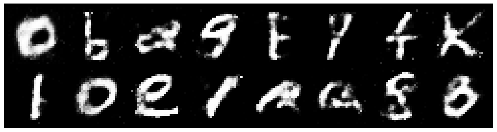

# Vanilla GAN with Inversion and export to ONNX

Training a GAN on the EMNIST alphanumeric handwriting dataset, performing inversion, and exporting to ONNX. Network and training code copied almost verbatim from Diego Gomez's great PyTorch [implementation](https://github.com/diegoalejogm/gans).

I've written about this project in more detail [here](https://zackrdavis.github.io/fonting-with-gans/).

## Untwisting EMNIST

EMNIST from PyTorch is mirrored and rotated 90 degrees, so I fix the data with some transforms.

## Training

Nothing new to see here.

## Inversion

Gradient-descent search through the generator's inputs in search of a good example of each character.

## Exporting to ONNX

Worked just as advertised.
